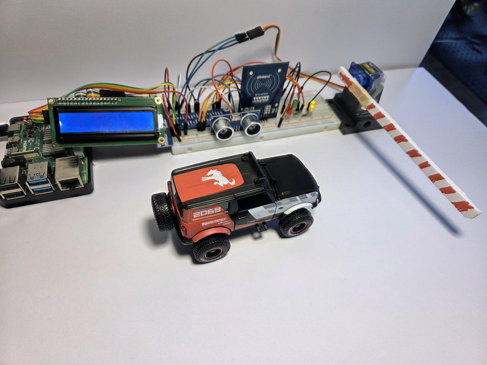

# RFID Gatearm Access – Raspberry Pi GPIO Pinout

## Project Summary

This project implements a smart access control system using a Raspberry Pi, integrated with the following components:

- RFID Reader (MFRC522) – scans RFID tags to verify identity
- Ultrasonic Sensor (HC-SR04) – detects when a user is within close range
- Servo Motor (GPIO15) – lifts a physical gate arm when access is granted
- 16x2 I2C LCD – displays messages such as "User Detected" or "Access Granted"
- LED Indicators – shows status (Red for error, Green for granted, Yellow for standby)

### 📸 Project Demo Setup

*Above: Smart RFID gate system with Raspberry Pi, MFRC522 RFID module, ultrasonic sensor, servo motor for the barrier, and a 16x2 I2C LCD displaying "User Detected". A toy truck is shown approaching the gate as a demonstration vehicle.*

### System Workflow

1. A user approaches the gate and the ultrasonic sensor detects proximity (typically 5 cm or less).
2. The system starts an RFID scan.
3. If a valid RFID tag is presented, the servo motor activates to lift the gate arm and the LCD displays confirmation.
4. If the tag is invalid or a timeout occurs, access is denied and the LCD and LEDs reflect the error state.

### Features

- Real-time integration of multiple hardware modules
- Clear visual feedback via LCD and LED indicators
- Modular Python code structure
- Suitable for use in access control demos, IoT projects, and physical computing labs

Optional: An 8x8 MAX7219 LED Matrix can be included to display simple visual status indicators (e.g., check mark or error symbol).

---

## HC-SR04 Ultrasonic Sensor

| HC-SR04 Pin | Function        | Raspberry Pi GPIO             | Notes                                                  |
|-------------|------------------|-------------------------------|--------------------------------------------------------|
| VCC         | Power supply     | 5V (Pin 2 or 4)               | Needs 5V, not 3.3V                                     |
| GND         | Ground           | GND (Pin 6, 9...)             | Must share ground with Pi                              |
| TRIG        | Trigger signal   | GPIO 23 (Physical Pin 16)     | Set HIGH for 10µs to trigger                           |
| ECHO        | Echo receive     | GPIO 24 (Physical Pin 18)     | Must use voltage divider (5V → 3.3V) to protect GPIO   |

---

## 8x8 LED Matrix (MAX7219 via SPI)

| Pin Name | Function      | Raspberry Pi GPIO            | Notes                            |
|----------|---------------|-------------------------------|----------------------------------|
| VCC      | Power         | 3.3V or 5V (based on module) | Check module's voltage rating    |
| GND      | Ground        | GND                          | Common ground                    |
| DIN      | SPI MOSI      | GPIO 10 (Physical Pin 19)    | SPI0 MOSI                        |
| CLK      | SPI Clock     | GPIO 11 (Physical Pin 23)    | SPI0 SCLK                        |
| CS       | Chip Select   | GPIO 7  (Physical Pin 26)    | SPI0 CE1 (used as device=1)      |

---

## RFID Reader (MFRC522)

| Pin Name | Function            | Raspberry Pi GPIO             | Notes                           |
|----------|---------------------|-------------------------------|---------------------------------|
| SDA      | SPI Chip Select     | GPIO 8  (Physical Pin 24)     | SPI0 CE0                        |
| SCK      | SPI Clock           | GPIO 11 (Physical Pin 23)     | Shared with LED Matrix         |
| MOSI     | Data from Pi        | GPIO 10 (Physical Pin 19)     | Shared with LED Matrix         |
| MISO     | Data to Pi          | GPIO 9  (Physical Pin 21)     | SPI0 MISO                       |
| RST      | Reset               | GPIO 25 (Physical Pin 22)     |                                 |
| GND      | Ground              | GND                           |                                 |
| 3.3V     | Power               | 3.3V                          | DO NOT use 5V                  |

---

## Servo Motor (SG90 or equivalent)

| Signal | Function         | Raspberry Pi GPIO             | Notes                                         |
|--------|------------------|-------------------------------|-----------------------------------------------|
| PWM    | Control Signal   | GPIO 15 (Physical Pin 10)     | Use `gpiozero` + `PiGPIOFactory` for accuracy |
| VCC    | Power            | 5V                            | From external power if needed                 |
| GND    | Ground           | GND                           | Must be shared with Pi                        |

---

## 16x2 I2C LCD (PCF8574 Backpack)

| Signal | Function        | Raspberry Pi GPIO             | Notes                            |
|--------|------------------|-------------------------------|----------------------------------|
| SDA    | I2C Data         | GPIO 2 (Physical Pin 3)       | I2C1                             |
| SCL    | I2C Clock        | GPIO 3 (Physical Pin 5)       | I2C1                             |
| VCC    | Power            | 5V                            | Some modules support 3.3V       |
| GND    | Ground           | GND                           | Shared ground                    |
| Addr   | I2C Address      | 0x27                          | Set via jumper on backpack       |

---

## Summary Table of GPIO Pins Used

| Component     | Signal / Function   | GPIO | Physical Pin |
|---------------|---------------------|------|--------------|
| HC-SR04       | TRIG                | 23   | 16           |
| HC-SR04       | ECHO                | 24   | 18           |
| RFID          | SDA (CS)            | 8    | 24           |
| RFID          | SCK                 | 11   | 23           |
| RFID          | MOSI                | 10   | 19           |
| RFID          | MISO                | 9    | 21           |
| RFID          | RST                 | 25   | 22           |
| LED Matrix    | CS                  | 7    | 26           |
| LED Matrix    | DIN (MOSI)          | 10   | 19           |
| LED Matrix    | CLK                 | 11   | 23           |
| Servo         | PWM Control         | 15   | 10           |
| LCD           | I2C SDA             | 2    | 3            |
| LCD           | I2C SCL             | 3    | 5            |

---
